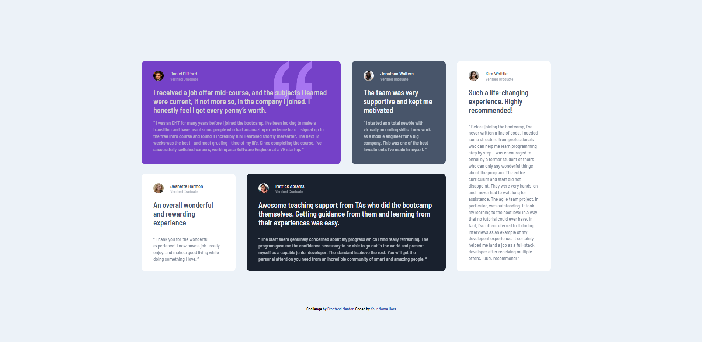

# Frontend Mentor - Solução da seção de grade de depoimentos

Esta é uma solução para o [desafio da seção de grade de depoimentos no Frontend Mentor](https://www.frontendmentor.io/challenges/testimonials-grid-section-Nnw6J7Un7). Os desafios do Frontend Mentor ajudam você a melhorar suas habilidades de codificação construindo projetos realistas.

## Índice

- [Visão geral](#visão-geral)
- [O desafio](#o-desafio)
- [Captura de tela](#captura-de-tela)
- [Links](#links)
- [Meu processo](#meu-processo)
- [Construído com](#construído-com)
- [O que aprendi](#o-que-aprendi)
- [Desenvolvimento contínuo](#desenvolvimento-continuo)
- [Recursos úteis](#recursos-úteis)
- [Autor](#autor)
- [Agradecimentos](#agradecimentos)

## Visão geral

### O desafio

Os usuários devem ser capazes de:

- Visualizar o layout ideal para o site, dependendo do tamanho da tela do dispositivo

### Captura de tela

### Links

- URL da solução: [https://www.frontendmentor.io/solutions/soluo-da-seo-de-grade-de-depoimentos-usando-flex-box-e-grid-edfSWr7XoB](https://www.frontendmentor.io/solutions/soluo-da-seo-de-grade-de-depoimentos-usando-flex-box-e-grid-edfSWr7XoB)
- URL do site ativo: [https://mariocarlaibe.github.io/testimonials-grid-section-main/](https://mariocarlaibe.github.io/testimonials-grid-section-main/)

## Meu processo

### Criado com

- Marcação HTML5 semântica
- Propriedades personalizadas CSS
- Flexbox
- Grid CSS
- Fluxo de trabalho mobile-first

### O que aprendi

eu aprendi que preciso continuar treinando o flex box e o grid.

### Desenvolvimento contínuo

preciso continuar a usar o first mobile para desenvolver melhor minhas tecnicas de adaptação de diferentes layouts.

### Recursos úteis

ChatGPT e Meta AI

## Autor

- Site - [Mário Carlaibe](https://github.com/MarioCarlaibe)
- Mentor de front-end - [@MarioCarlaibe](https://www.frontendmentor.io/profile/MarioCarlaibe)

## Agradecimentos

Agradeço ao DevQuest pelo conhecimento adquirido e as instruções fornecidas.